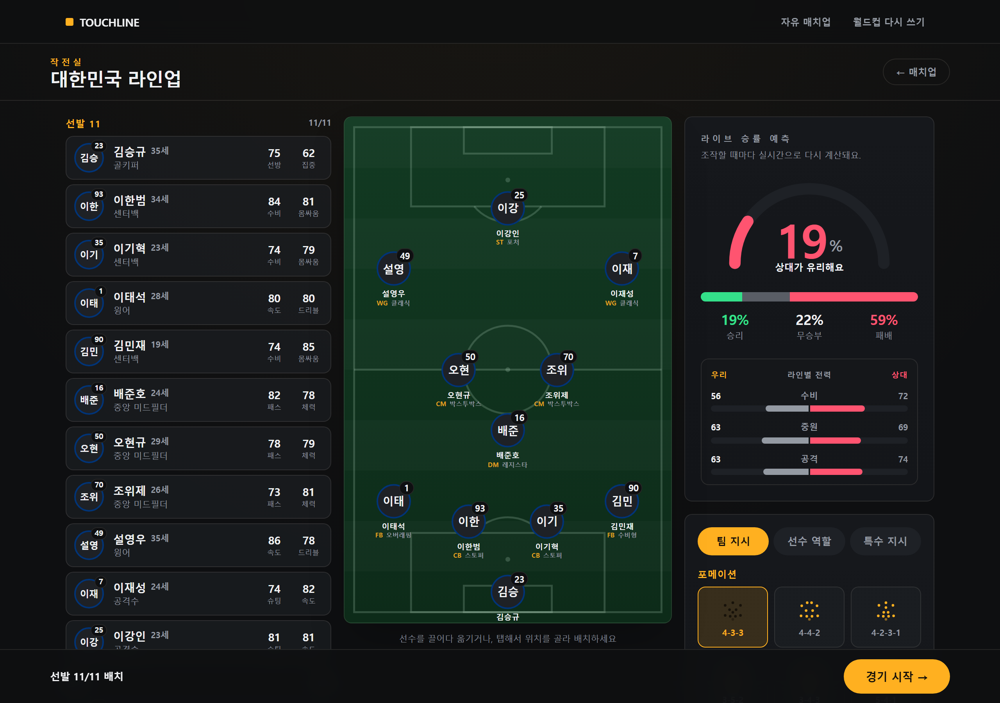
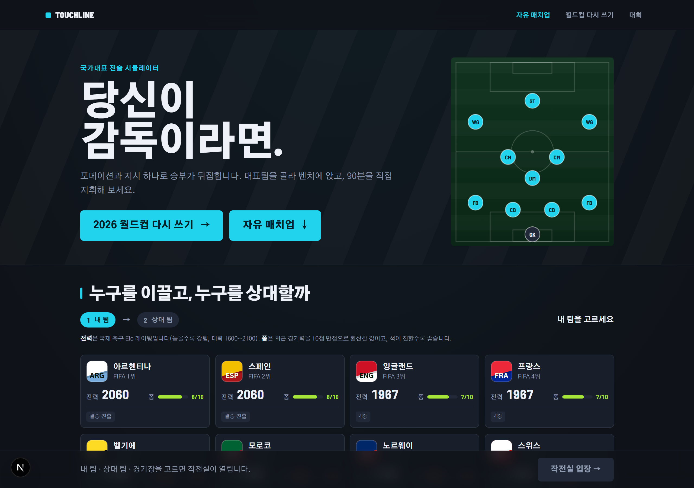
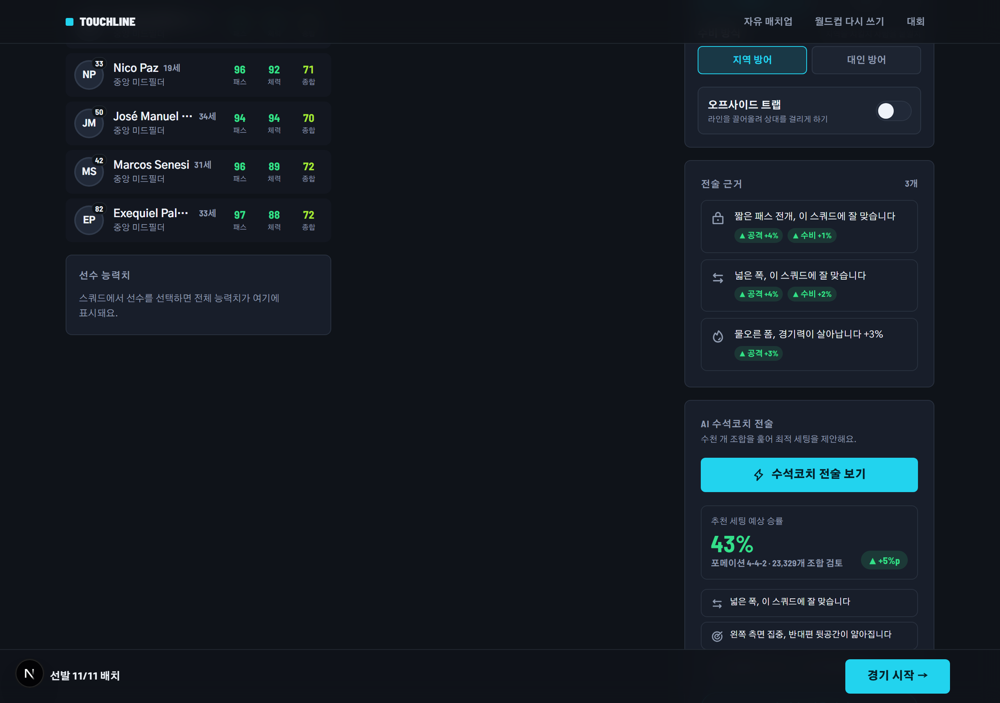
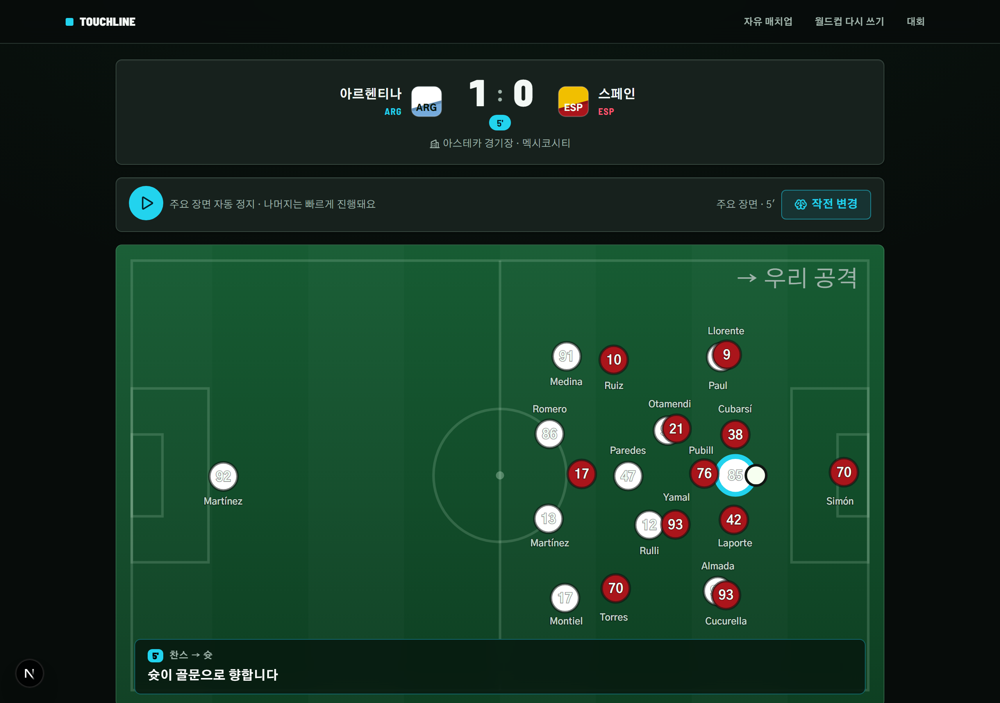
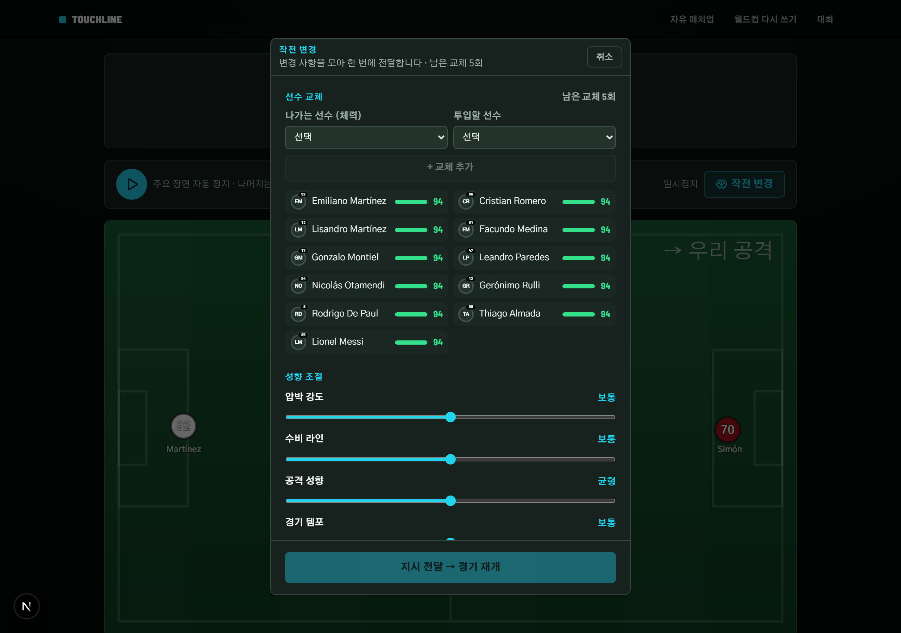
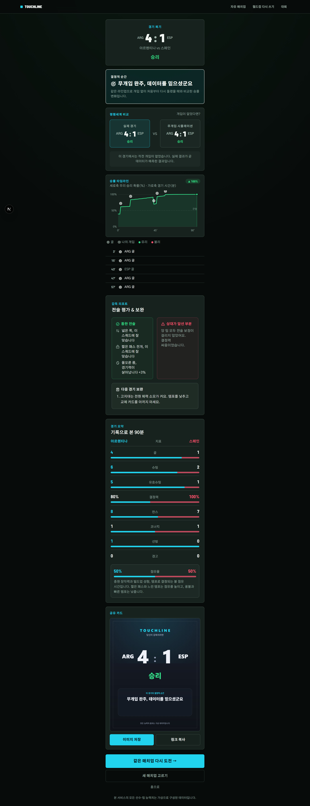
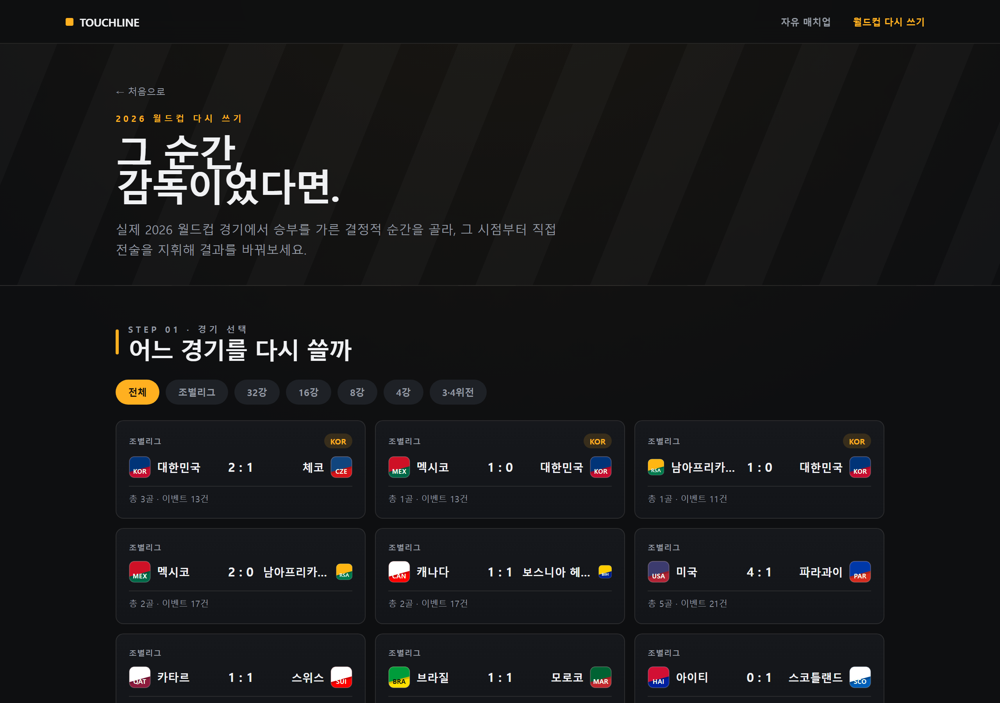
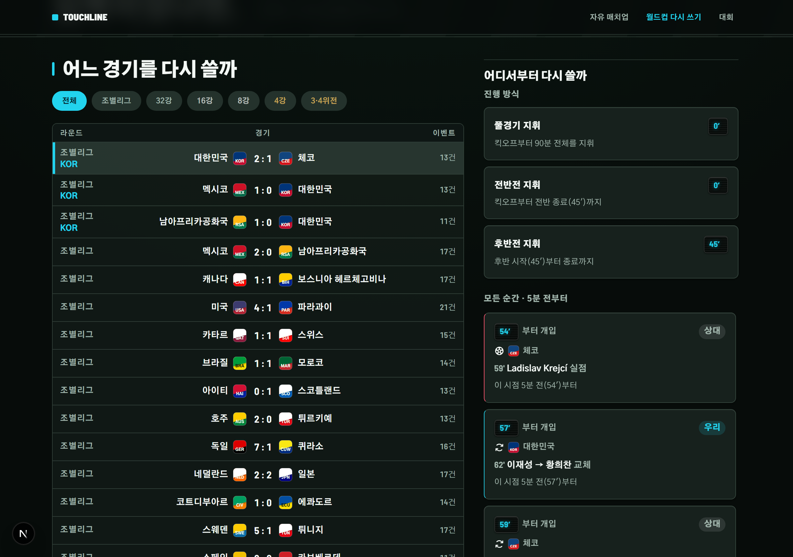
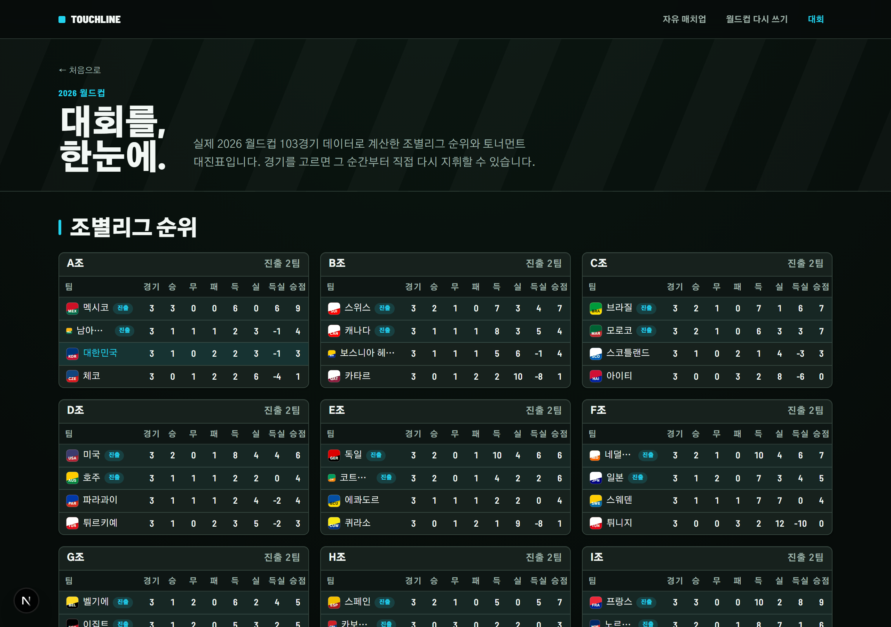
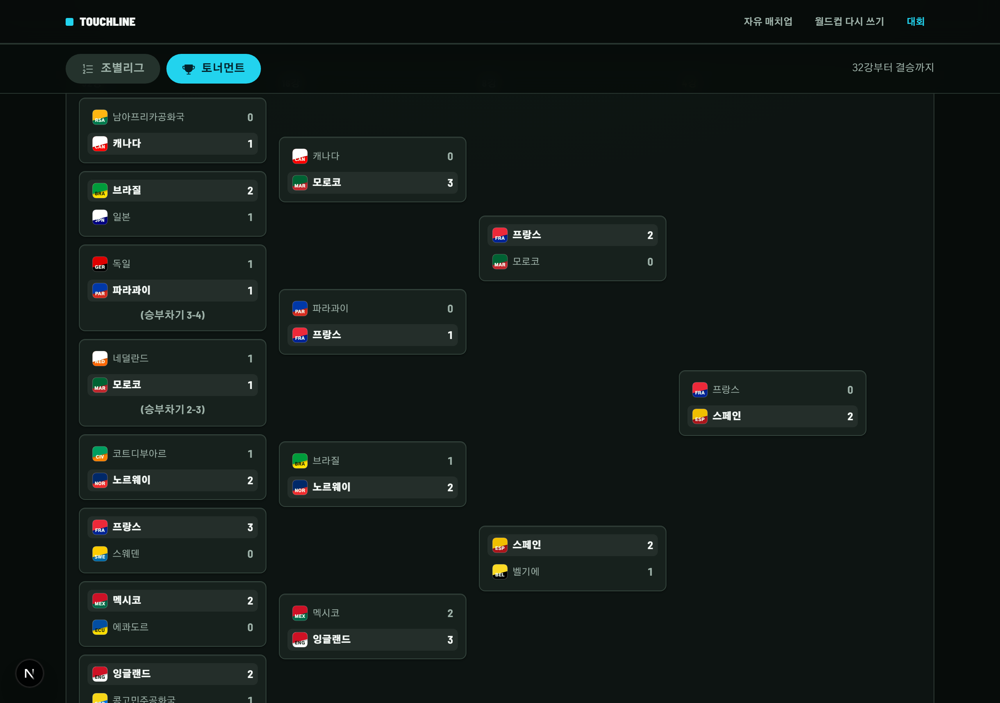

# 터치라인 (TOUCHLINE) - 당신이 감독이라면

> 상대팀·경기장을 고르고 선수를 드래그로 배치하면, **통계 엔진이 조작할 때마다 실시간으로 승률을 갱신**하고 근거와 함께 최적 전술을 추천합니다. 그 전술로 90분을 직접 지휘해 시뮬레이션하고, **감독의 개입이 결과를 어떻게 바꿨는지 같은 시드로 재현해 수치로 복기**하는 월드컵 전술 시뮬레이터입니다.

- **배포 URL**: https://touchline-fc.vercel.app
- **대상**: 데이콘 월간 해커톤 "내가 축구 감독이라면 - 월드컵 전술 웹서비스 챌린지"
- **특징**: 100% 클라이언트 통계 엔진 (외부 API·키·서버 **없음**), 시드 기반 재현 가능 시뮬레이션, 한국어 UI(국가대표 선수 실명 표기 포함)
- **디자인**: FM식 네이비-슬레이트 UI × 일렉트릭 시안(#22d3ee) 단일 액센트, 잔디는 별도 그린(`--color-turf`)으로 분리, 선수 능력치는 5단계 색상 스케일(등급 텍스트 병행)로 표시 - **제4심판 LED 보드**가 "몇 분부터 지휘하는가"를 모먼트 카드·프리셋·경기 중 배지 전 화면에서 동일하게 표시하는 시그니처 오브젝트



> 본 서비스의 모든 선수·팀 능력치는 가상으로 구성된 데이터입니다.

---

## 핵심 기능

| 기능 | 설명 | 화면 |
|---|---|---|
| **48개국 실제 매치업** | 2026 월드컵 실제 출전 48개국 중 두 팀을 실제 국기 색상·FIFA 랭킹·조별리그~결승 진출 태그와 함께 선택. 퀵스타트는 실제 한국 vs 브라질 매치업으로 즉시 진입 | 홈 |
| **실시간 승률 분석** | 선수 이동·교체, 포메이션·슬라이더·세부 지시 등 **모든 조작이 승률을 즉시 재계산**하고 변동량을 애니메이션으로 표시 | 작전실 · 경기 |
| **3계층 전술 시스템** | ① 팀 지시(포메이션·압박·라인·템포·빌드업·방향·폭·수비방식·트랩) ② 선수 역할(타겟맨/폴스나인/인버티드 윙 등) ③ 특수 지시(맨마킹·세트피스·주장) | 작전실 |
| **AI 추천 전술** | 23,328개 팀 지시 조합을 온디맨드로 전수 평가해 최고 승률 세팅과 요인별 근거 카드를 제시 | 작전실 |
| **경기 개입** | 자유 일시정지·위기 알림 → 교체(최대 5명)·전술 변경 → 엔진 재계산 후 재개, 후반 체력 감쇠 반영 | 경기 |
| **카운터팩추얼 복기** | 같은 시드로 무개입 경기를 재시뮬해 "개입이 없었다면?" 평행세계와 비교, 개입별 승률 델타 산출 | 복기 |
| **승부차기** | 무승부 시 키커 5명·순서를 지정, PK·멘탈 vs GK 선방 확률 대결 | 승부차기 |
| **2026 월드컵 다시 쓰기** | 실제 2026 월드컵 103경기 중 하나를 골라 진입 방식을 선택 - 풀경기/전반전/후반전 프리셋 3종은 이벤트 유무와 무관하게 항상 뜨고, 그 경기의 모든 골·교체·경고·퇴장도 각각 "5분 전부터" 진입점이 되어(무카드 완승이라도 막다른 화면 없음) 실제 선발·스코어·체력 소모가 반영된 상태에서 남은 시간을 직접 지휘 → 종료 후 **실제 역사 vs 내 평행세계** 스코어를 나란히 비교. 선수는 한국어 실명, 경기장은 2026 개최 실제 16개 구장의 고도·기온·돔 데이터를 그대로 사용 | 다시 쓰기 |
| **대회 - 조별리그 순위·토너먼트 대진표** | 실제 103경기 데이터에서 렌더 시점에 계산한 12개 조(A~L) 순위표(경기/승/무/패/득/실/득실/승점, 진출 2팀 라벨, 대한민국 행 강조)와 32강~결승 대진표(3·4위전 포함, 승부차기는 "(승부차기 N-N)"으로 표기) - 모든 경기 카드가 `/rewrite?match=<id>`로 연결돼 그 순간부터 바로 다시 지휘할 수 있음 | 대회 |

### 화면 갤러리

| 홈 - 매치업 설정 | 작전실 - AI 추천 |
|---|---|
|  |  |

| 경기 - 위기 알림·하프타임 개입 | 경기 - 작전 변경 시트 |
|---|---|
|  |  |

| 복기 - 카운터팩추얼 평행세계 비교 |
|---|
|  |

| 다시 쓰기 - 실제 월드컵 경기 브라우저 | 다시 쓰기 - 진입점 선택(제4심판 LED 보드) |
|---|---|
|  |  |

| 대회 - 조별리그 순위 | 대회 - 토너먼트 대진표 |
|---|---|
|  |  |

---

## 기획 의도 → 구현 매핑 (평가기준)

해커톤 평가기준(참신성 / 감독 경험 설계 / 완성도)을 각각 어떤 장치로, **어느 파일에서** 구현했는지 정리했습니다. 모든 경로는 이 저장소에 실재합니다.

### 참신성 (30)

| 기획 장치 | 구현 | 파일 경로 |
|---|---|---|
| 모든 조작에 실시간 반응하는 승률 | 조작 → `winProbability` 동기 재평가(목표 100ms 이내) → 게이지·근거 카드 갱신 | `lib/engine/winprob.ts`, `lib/store.ts`, `components/tactics/` |
| 실제 개최지 환경 변수(고도·더위·돔)가 전술 유불리를 바꿈 | `altitude`/`heat` 보정 규칙 + venue 데이터(고도·기온·돔) | `lib/engine/modifiers.ts`, `lib/data/venues.ts` |
| "개입이 없었다면?" 카운터팩추얼 복기 | 동일 시드로 무개입 재시뮬 → 개입별 승률 델타·평행세계 스코어 비교 | `lib/engine/counterfactual.ts`, `app/result/page.tsx` |
| 실제 2026 월드컵 경기 기반 "다시 쓰기" | 실제 103경기 데이터에서 결정적 순간을 자동 추출 → 그 시점의 실제 스코어·라인업·교체·퇴장을 엔진 상태로 복원 → 남은 시간을 시뮬레이션해 실제 역사와 비교 | `lib/wc2026/`, `lib/engine/rewrite.ts`, `app/rewrite/`, `components/rewrite/` |
| "경기 목록"이 아니라 "대회" - 조별리그 순위·대진표를 렌더 시점에 계산 | 별도 저장 데이터 없이 103경기에서 승점/골득실 순위(타이브레이커: 승점→득실→다득점→팀코드)와 32강~결승 대진표를 그때그때 산출, 모든 경기가 다시 쓰기 진입점으로 연결 | `lib/wc2026/standings.ts`, `app/tournament/page.tsx`, `components/tournament/` |

### 감독 경험 설계 (25)

| 기획 장치 | 구현 | 파일 경로 |
|---|---|---|
| 3계층 전술(팀 지시 → 선수 역할 → 특수 지시) | 포메이션·슬라이더·세부 지시, 역할별 능력치 가중, 맨마킹/세트피스/주장 | `components/tactics/`, `lib/data/formations.ts`, `lib/data/roles.ts`, `lib/engine/modifiers.ts` |
| FM식 능력치 그리드 + 정렬 가능 스쿼드 | 선수 선택 시 12개 능력치(8종 기본 + 세트피스/공중볼/PK/멘탈) 전체를 5단계 색상 스케일로 표시(색이 유일한 신호가 되지 않도록 최상/우수/보통/미흡/취약 등급을 스크린리더 텍스트로 병행), 스쿼드는 이름·나이·선택한 능력치 기준으로 정렬(`aria-sort`, 방향 캐럿) - 드래그 배치·탭-투-배치는 그대로 유지 | `components/tactics/AttributeGrid.tsx`, `components/tactics/SquadList.tsx`, `components/tactics/squad-sort.ts`, `components/tactics/attr-color.ts` |
| 드래그 배치 + 탭-투-배치(접근성) | dnd-kit 포인터/터치 센서 + 키보드 대체 배치 | `components/tactics/`, `app/tactics/page.tsx` |
| 자유 일시정지 지시 · 위기 순간 알림 · 방송 중계형 연출 | 라이브 피치·중계 피드·승률 타임라인, 위기 배너, 개입 시트 | `components/match/`, `app/match/page.tsx`, `lib/engine/match.ts` |
| 승부차기 키커 순서 지정 | PK·멘탈 vs GK 선방 확률 미니게임 | `lib/engine/shootout.ts`, `app/shootout/page.tsx` |
| "그 순간, 감독이었다면" - 막다른 길 없는 유연한 개입 시점 | 경기 브라우저(라운드·조 필터, URL 딥링크) → 풀경기/전반전/후반전 프리셋 3종(이벤트 유무와 무관하게 항상 노출) + 그 경기의 모든 골·교체·경고·퇴장을 "5분 전부터" 진입 카드로 - 득점자, 교체 OUT→IN, 카드 받은 선수를 양 팀 동일한 방식으로 이름까지 표기 → 선택 즉시 그 시점의 실제 스코어·라인업·체력 소모가 반영된 상태로 `/tactics`·`/match`를 그대로 재사용해 지휘 | `app/rewrite/page.tsx`, `components/rewrite/MatchBrowser.tsx`, `components/rewrite/MomentCards.tsx`, `lib/wc2026/entry-points.ts`, `lib/engine/rewrite.ts` |
| 제4심판 LED 보드 - 개입 시점의 시각적 시그니처 | "몇 분부터 지휘하는가"를 모먼트 카드·프리셋·경기 중 컨텍스트 배지 전부에서 동일한 LED 보드 컴포넌트로 표시(시안 발광) - 장식이 아니라 그 숫자 자체가 핵심 정보 | `components/ui/OfficialBoard.tsx` |

### 완성도 (25) + 기획/구현 완성도 (20)

| 기획 장치 | 구현 | 파일 경로 |
|---|---|---|
| 100% 클라이언트 엔진 (외부 API·키 없음 → 심사 중 장애 원천 차단) | `output: 'export'` 완전 정적 빌드, 순수 TS 엔진 | `next.config.ts`, `lib/engine/` |
| 시드 기반 재현 가능한 시뮬레이션 | seedable RNG로 분 단위 이벤트 체인 결정론적 생성 | `lib/engine/random.ts`, `lib/engine/match.ts` |
| 엔진 단위 테스트 + 밸런싱 검증 | vitest 255개(32파일, wc2026 정합성·복기·진입점·대회 순위·대진표 테스트 포함) + 몬테카를로 밸런스 게이트 | `lib/engine/*.test.ts`, `lib/engine/balance.test.ts`, `lib/wc2026/*.test.ts` |
| 기획서 인터랙션 = 실제 화면 1:1, README 매핑표 | 4+1 화면(홈/작전실/경기/승부차기/복기) + 다시 쓰기 라우트 구현 | `app/page.tsx`, `app/tactics`, `app/match`, `app/shootout`, `app/result`, `app/rewrite` |
| 실제 데이터 정합성 검증 + 100% 클라이언트 유지 | ESPN 원본 → 정규화 스키마 변환 스크립트(1회 실행, 결과만 커밋), 골 수=스코어·선발 11명·레드카드 이후 이벤트 없음 등 정합성 테스트 | `scripts/ingest-wc2026.mjs`, `scripts/build-wc2026.mjs`, `lib/wc2026/integrity.test.ts` |
| 한국 관객 기준 선수 이름 표기 | ESPN 로마자 표기(예: Son Heung-Min)를 한글(손흥민)로 치환 - 국가대표 26명 전원 + 글로벌 약 68명 매핑, 미매핑 시 로마자 원본으로 폴백(공백/크래시 없음) | `lib/wc2026/player-names.ts` |
| 전역 내비게이션 + 딥링크 가능한 상태 | 워드마크 헤더(자유 매치업 ↔ 다시 쓰기 전환)와 `?round=&group=&match=&side=` 쿼리로 다시 쓰기 화면 상태를 URL 하나로 복원 - 뒤로가기·새로고침·링크 공유가 전부 동일 화면을 재현 | `components/ui/AppHeader.tsx`, `app/rewrite/page.tsx`, `components/rewrite/MatchBrowser.tsx` |

> 스펙 원문: `docs/superpowers/specs/2026-07-17-touchline-tactics-simulator-design.md` (§2 우승 전략 매핑, §5 엔진 명세)

---

## 통계 엔진

엔진은 `lib/engine/`의 순수 함수로만 구성됩니다(입력 → 출력, UI 무의존). 튜닝 상수는 전부 `lib/engine/constants.ts` 한 곳에 모여 있습니다.

### 기대 득점 λ 산출 (`lib/engine/winprob.ts`)

```
λ_me = clamp(
         LAMBDA_BASE
         × (myAtt / oppDef) ^ LAMBDA_ELASTICITY      // 전력비의 비선형 반영
         × (modMe.attackMult / modOpp.defenseMult)    // 전술·환경·히스토리 보정
         × eloMult(myElo, oppElo),                    // ELO 베이스라인
         LAMBDA_MIN, LAMBDA_MAX
       )

eloMult(a, b) = 1 + clamp(a − b, ±ELO_DIFF_CAP) / ELO_DIFF_CAP × ELO_MULT_COEF
myAtt = 0.55·att + 0.35·mid + 0.10·def
oppDef = 0.50·def + 0.30·mid + 0.20·gk
```

실제 상수값 (`lib/engine/constants.ts`):

| 상수 | 값 | 역할 |
|---|---|---|
| `LAMBDA_BASE` | **1.35** | 기준 기대 득점 |
| `LAMBDA_ELASTICITY` | **1.6** | 공/수 전력비의 탄력도(비선형 지수) |
| `LAMBDA_MIN` / `LAMBDA_MAX` | **0.2 / 4.0** | λ clamp 범위 |
| `ELO_DIFF_CAP` | **400** | ELO 차 반영 상한 |
| `ELO_MULT_COEF` | **0.15** | 최대 ELO 차에서의 λ 배수 폭(±15%) |
| `GOAL_PROB_BASE` | **0.3** | 슈팅 후 골 확률 기준값 |
| `GOAL_PROB_DIVISOR` | **300** | 기여도 편차 → 골 확률 환산 제수 |
| `GOAL_PROB_MIN` / `GOAL_PROB_MAX` | **0.03 / 0.95** | 골 확률 clamp |
| `CHANCE_RATE_SCALE` | **10.0** | 분당 찬스 발생률 튜닝 배수 |
| `SHOT_CONVERSION_PROB` | **0.55** | 찬스 → 슈팅 전환 확률 |
| `REALIZED_GOAL_CALIBRATION` | **1.12** | 실시간 승률 그래프 보정(실측 회귀 검증) |

λ로부터 승/무/패 확률은 포아송 이중합으로 계산합니다(`lib/engine/poisson.ts`, a·b 각 0..30). 승률 합은 항상 1(테스트로 검증).

### 산출 파이프라인

1. **선수 기여도** (`lib/engine/strength.ts`): 능력치 × 역할 가중 프로파일 × 포지션 적합도 × 나이 커브(포지션별 피크 상이) × 컨디션
2. **라인별 전력**: 수비/중원/공격 3라인 + GK 집계, 맨마킹 지정 시 위협도 재배분
3. **보정 규칙** (`lib/engine/modifiers.ts`): `RULE_DEFS` **15종**을 `me` 시점으로 평가해 `attackMult`/`defenseMult`에 누적
4. **기대 득점 λ → 포아송 승/무/패**
5. **경기 시뮬** (`lib/engine/match.ts`): 시드 기반 분 단위 이벤트 체인(찬스→슈팅→골/세이브), 체력·전술 변경에 따라 분당 λ 갱신

### 보정 규칙 카테고리 (`lib/engine/modifiers.ts` · `RULE_DEFS` 15종)

- **전술 상성**: `high_line_vs_pace`(높은 라인 vs 스피드), `direct_targetman`(롱볼×타겟맨 시너지), `short_vs_press`(숏빌드업 vs 강압박), `focus_vs_weakflank`(상대 약측면 공략), `wide_vs_narrow`(폭 상성), `counter_style`(높은 라인 뒤 역습), `offside_trap`(오프사이드 트랩)
- **맨마킹·수비 방식**: `man_marking_fatigue`(전담 마크 조직력↑), `man_marking_scheme`(대인방어 vs 드리블러)
- **환경**: `altitude`(고지대 압박 페널티), `heat`(폭염·비돔 체력 소모)
- **히스토리·멘탈**: `form`(팀 폼), `h2h_edge`(상대전적 우위), `captain_mental`(강심장 주장)
- **템포**: `tempo_stamina`(빠른 템포 압박)

### AI 추천 (`lib/engine/recommend.ts`)

포메이션 6종 × 압박·라인·공격성향·템포(각 3) × 빌드업·폭·수비방식·트랩(각 2) × 공격방향(3) = **23,328개** 팀 지시 조합을 전수 평가합니다. "추천 전술 보기" 클릭 시 **온디맨드로만** 실행(조작마다 도는 것은 단일 승률 평가 1회). 라인업 파생값 캐시·λ 분리 계산으로 예산 내 처리합니다.

### 시드 기반 재현성 (`lib/engine/random.ts`)

동일 (라인업, 전술, venue, 시드)는 항상 동일한 경기를 생성합니다. 하이라이트 점프 재생·새로고침에도 결과가 보존되며, 이것이 카운터팩추얼의 전제입니다.

### 카운터팩추얼 정합성 불변식 (`lib/engine/counterfactual.ts`, 테스트: `counterfactual.test.ts`)

참신성 킬러 피처를 방어하는 3가지 불변식을 테스트로 강제합니다:

1. **무개입 baseline은 원 경기의 개입 이전 구간과 이벤트가 완전 동일** (동일 시드)
2. **원 경기의 개입 로그를 재적용하면 원 경기를 100% 재현**
3. **개입이 없는 경기의 카운터팩추얼 델타 = 정확히 0**

### 몬테카를로 밸런스 검증 (`lib/engine/balance.test.ts`)

전 매치업(16×15) × 20시드 = **4800회** 시뮬레이션을 테스트로 자동화해 "납득 가능한 결과 분포"를 게이트로 강제합니다. 실측값:

| 지표 | 실측 | 게이트 |
|---|---|---|
| ELO 150+ 우위팀 승률 | **0.596** | 0.55 ~ 0.90 |
| 경기당 평균 총득점 | **3.12골** | 1.8 ~ 3.6 |
| 5골차 이상 블로아웃 비율 | **0.77%** | < 4% |
| 무승부 비율 | **26.4%** | 15% ~ 35% |

---

## 실행 방법

```bash
npm install
npm run dev          # 개발 서버 (http://localhost:3000)

npm run build        # 정적 export 빌드 → out/
```

## 테스트

```bash
npx vitest run       # 엔진 단위 + 밸런스 + wc2026 테스트 (255개 / 32파일)
npx playwright test  # 핵심 플로우 E2E 스모크 (홈→작전실→경기→복기)
npx tsc --noEmit     # 타입 체크
```

---

## 품질 · 접근성

Web Interface Guidelines 준수 점검을 반영했습니다.

- **테마·진입**: `theme-color` 메타, 본문 최상단 스킵 링크(`#main`)
- **다이얼로그·시트**: Escape 닫기 + 포커스 트랩, 시트류 `overscroll-behavior: contain`
- **모션**: 트랜지션 속성을 명시적으로 선언(예: `transition-[width,background-color]`, `all` 금지), 헤드라인은 `text-balance`
- **딥링크**: `/rewrite`는 `?round=&group=&match=&side=` 쿼리가 상태의 단일 소스 - 뒤로가기·새로고침·링크 공유로 동일 화면이 복원되며, 정적 export에서 `useSearchParams()`를 쓰기 위해 `Suspense` 경계로 감쌌습니다
- **렌더 예산**: 103경기를 한 번에 그리지 않고 24장 + "더 보기"로 이어붙입니다
- **색 대비 · 터치 타깃**: 모든 색 조합이 WCAG AA를 통과(최저 대비 5.70:1)하고, 모바일 터치 타깃은 44×44px 이상입니다

---

## 기술 스택

- **프레임워크**: Next.js 16 (App Router) + React 19 + TypeScript
- **스타일**: Tailwind CSS v4 - FM식 네이비-슬레이트 중립(`--color-pitch: #0f1319`) UI × 일렉트릭 시안(`--color-accent: #22d3ee`) 단일 액센트, 잔디만 별도 그린(`--color-turf: #10331f`)으로 분리, 능력치 전용 5단계 색상 스케일(`--color-attr-elite|good|mid|low|poor`)은 액센트와 분리된 시맨틱 데이터 색
- **상태**: Zustand (`persist` + sessionStorage - 새로고침·뒤로가기에도 배치·역할·특수 지시 전부 보존)
- **드래그 배치**: dnd-kit (포인터/터치 센서 + 탭-투-배치 대체)
- **애니메이션·차트**: Framer Motion + 자체 SVG
- **배포**: Vercel (`output: 'export'` 정적 빌드)

### 아키텍처

모든 도메인 로직은 `lib/engine/`의 **순수 TypeScript**에 있고 UI에 의존하지 않습니다. Next.js는 `output: 'export'`로 완전 정적 빌드되어 **서버 런타임·외부 API·API 키가 전무**합니다 - 승률/추천/시뮬레이션/카운터팩추얼이 전부 브라우저에서 동기 계산되므로 심사 중 서버 장애나 네트워크 의존이 원천 차단됩니다. 화면(`app/`, `components/`)은 엔진 출력을 받아 표시만 하며, 튜닝 지점은 `lib/engine/constants.ts` 한 곳으로 격리되어 있습니다.

---

## 가상 데이터 고지

**본 서비스의 모든 선수·팀 능력치는 가상으로 구성된 데이터입니다.** 선수 사진·초상은 사용하지 않고 이니셜 아바타로 대체하며, 팀 배지는 자체 제작한 텍스트 배지입니다.

2026 월드컵 실제 경기 데이터(경기 결과·득점·교체·카드, 분 단위)는 ESPN 공개 데이터에서 빌드 타임에 1회 수집해 정적 커밋했으며, 서비스 런타임은 여전히 100% 클라이언트(외부 API·키 없음)입니다. 실제 사용된 데이터는 **이름·포지션·출전/득점/교체/카드 기록**뿐이고, 능력치·세트피스·공중볼·PK·멘탈 등 모든 수치는 여전히 가상 생성입니다. 선수 이름은 한국 관객 기준으로 로마자 원본을 한글로 표시(`lib/wc2026/player-names.ts`, 매핑이 없으면 로마자 폴백)하며, 다시 쓰기 모드의 경기장은 2026 실제 개최 16개 구장의 고도·평균 기온·돔 여부를 그대로 사용합니다(`lib/wc2026/venues.ts`).
